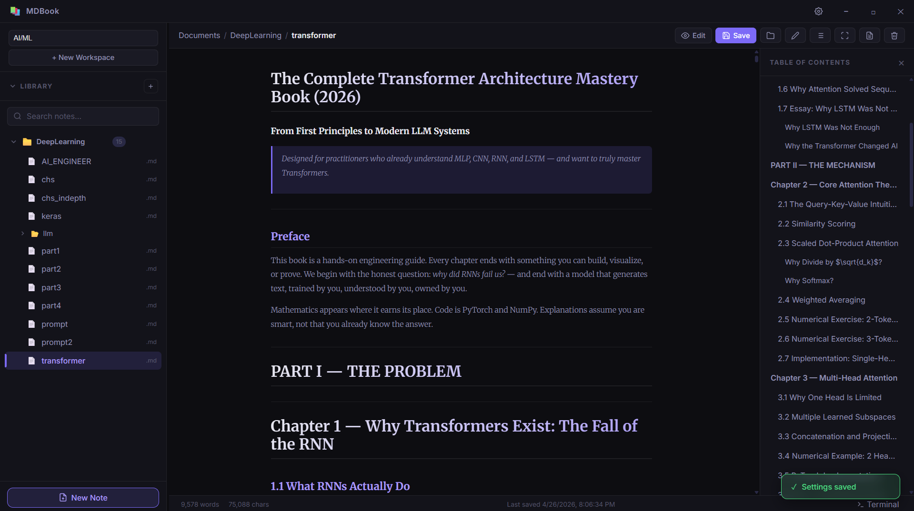
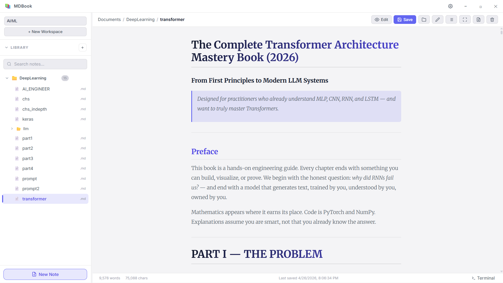
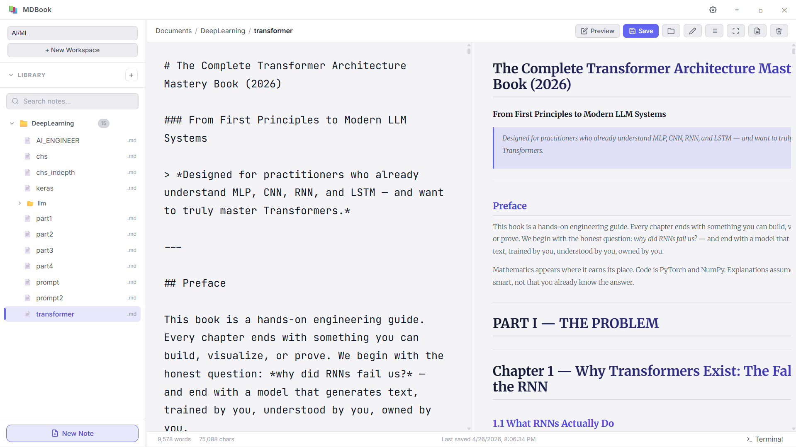
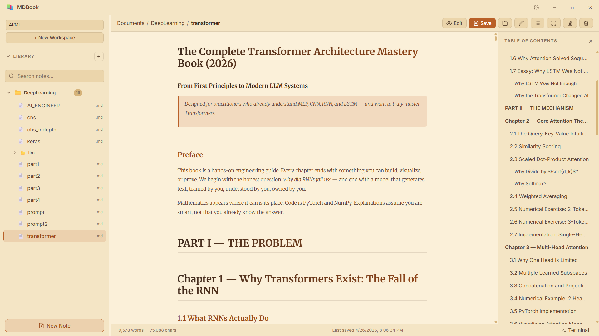
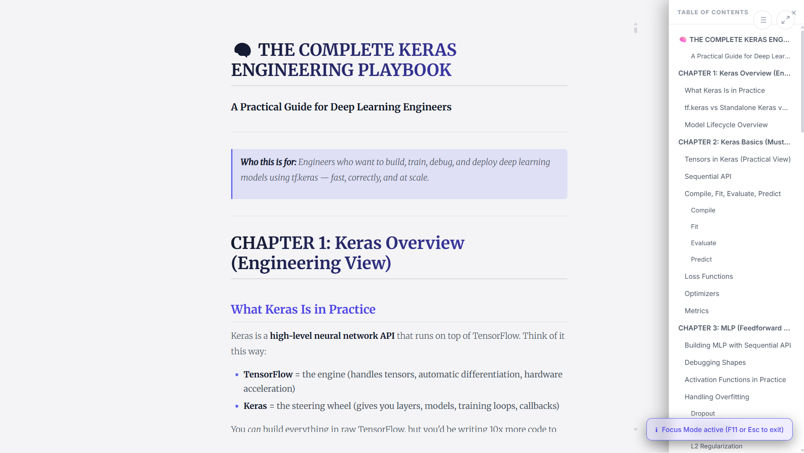
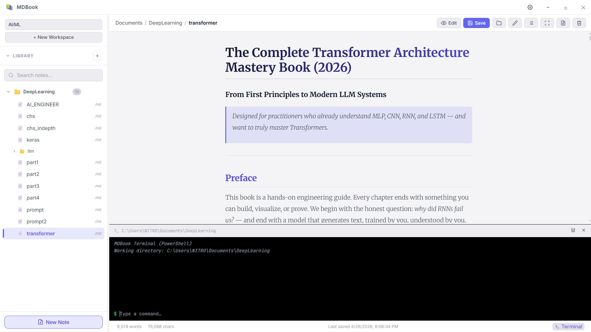

# MDBook

MDBook is a beautiful, offline-first Markdown note-taking and library application built with Electron. It combines the power of a technical editor with the elegance of a modern reader.



## Why MDBook?

MDBook isn't just another markdown editor. It's designed for people who build knowledge bases, write technical books, and manage complex projects locally.

### 📚 Professional Organization
Manage your library with ease. Organize notes into **Workspaces** and nested **Folders**. Perfect for keeping your Programming, Personal, and Research notes strictly separated.



### ✍️ Split-Pane Power
Experience seamless writing with our side-by-side editor and live-rendered HTML preview. Featuring full code syntax highlighting via `highlight.js`.



### 📖 Immersive Reading
Switch to **Reader Mode** or use the **Reader Theme** for a distraction-free experience. The integrated **Table of Contents** makes navigating long documents a breeze.




### ⌨️ Developer First
Need to run a script, check git, or move files? The **Integrated Terminal** is just a `Ctrl + \`` away, automatically tracking your current note's directory.



---

## Features At A Glance

- **Multi-Theme Engine**: Dark, Light, and Sepia Reader themes.
- **Custom CSS**: Inject your own styles to make MDBook yours.
- **Auto-Save**: Background saving ensures you never lose a word.
- **Focus Mode**: Hide the UI and focus purely on your content.
- **High Performance**: Built for speed, even with massive markdown libraries.

## Usage

You can download the bundled executable from the Releases page, or run from source:

```bash
# Install dependencies
npm install

# Run the app
npm start
```

## Settings & Data

All your settings, themes, and library indexes are securely stored in your local `userData` folder. You can find this path at the bottom of the Settings menu (`Ctrl + ,`).

---
Built with ❤️ using HTML, CSS, JavaScript, and Electron.
